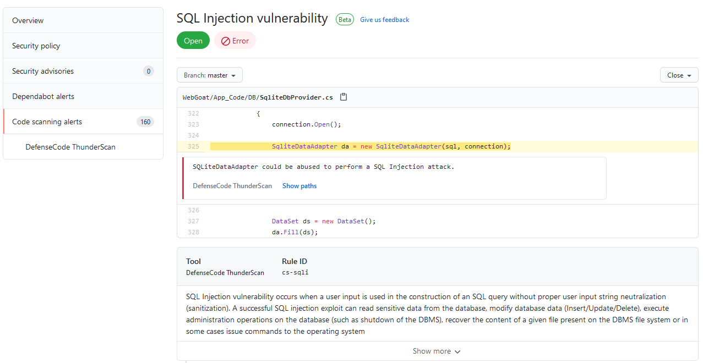
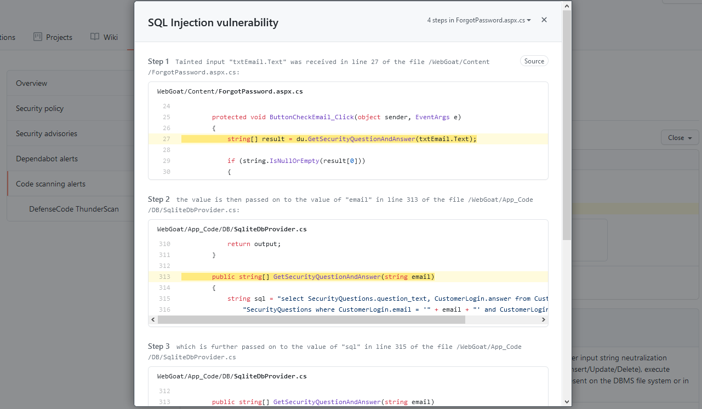

# DefenseCode ThunderScan Github Action  

DefenseCode ThunderScan GitHub Action with SARIF output.
<p align="center">
  
</p>

* **DefenseCode ThunderScan®** is a SAST (Static Application Security Testing, WhiteBox Testing) solution for performing deep and extensive security analysis of application source code. ThunderScan® is easy to use and can be deployed during or after development with easy integration into DevOps environment and CI/CD pipeline.

* **DefenseCode WebScanner** is a DAST (Dynamic Application Security Testing, BlackBox Testing) solution for comprehensive security audits of active web applications (websites). WebScanner will test a website’s security by carrying out a large number of attacks using the most advanced techniques, just as a real attacker would.

Find more info in the official website: [DefenseCode.com](https://www.defensecode.com)

## Inputs

| Variable  | Example Value | Description | Type | Required | Default |
| ------------- | ------------- | ------------- |------------- | ------------- | ------------- |
| api_url | https://localhost:8999| ThunderScan API URL | String | Yes | N/A
| api_token | ${{ secrets.THUNDERSCAN_TOKEN }} | ThunderScan API Token | Secure String | Yes | N/A
| client_path | /opt/thunderscan/tsactioncli | ThunderScan Client Path | String  | Yes | N/A
| engines | 2 | ThunderScan Engine IDs | String  | No | N/A

## Outputs

The default output format for this GitHub Action is a [SARIF](https://docs.github.com/en/github/finding-security-vulnerabilities-and-errors-in-your-code/sarif-support-for-code-scanning) output report stored in the working directory as **./thunderscan-sarif.json**

## Example Usage

ThunderScan action runs on a self-hosted runner, utilizing a ThunderScan API CLI client. 

```
    steps:
    # Checks-out your repository under $GITHUB_WORKSPACE, so your job can access it
    - uses: actions/checkout@v2

    # ThunderScan Action
    - name: ThunderScan
      uses: defensecode/thunderscan-action@v1.0
      with:
        api_url: 'http://localhost:8999'
        client_path: '/opt/thunderscan/tsactioncli'
        api_token:  ${{ secrets.THUNDERSCAN_TOKEN }}

    - name: Expose report
      uses: actions/upload-artifact@v2
      with:
        name: SARIF results
        path: thunderscan-sarif.json
    # Uploads thunderscan-sarif.json to GitHub repository using the upload-sarif action
    - uses: github/codeql-action/upload-sarif@v1
      with:
        # Path to SARIF file relative to the root of the repository
        sarif_file: thunderscan-sarif.json
```

## Security Alerts Sample



